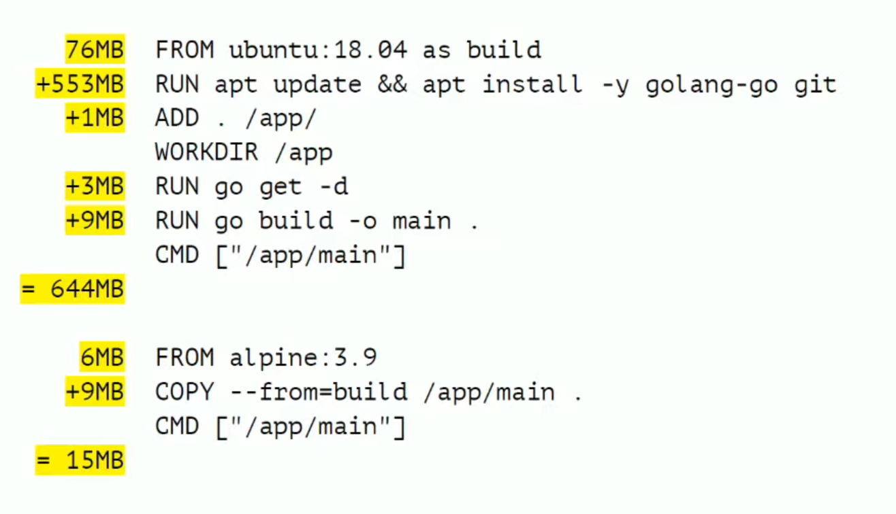
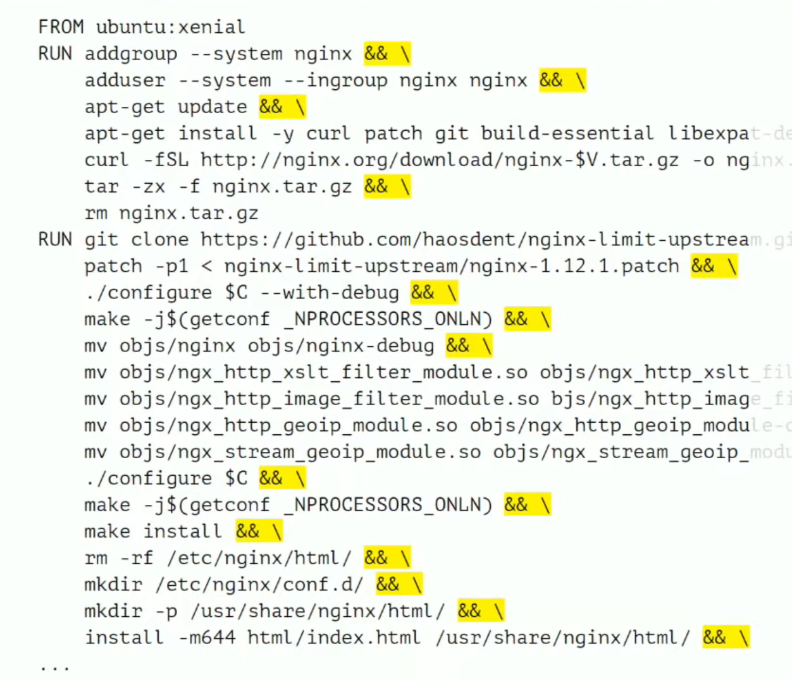
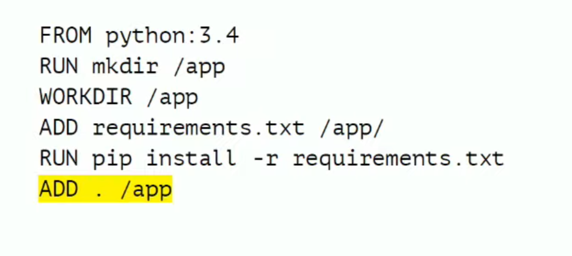
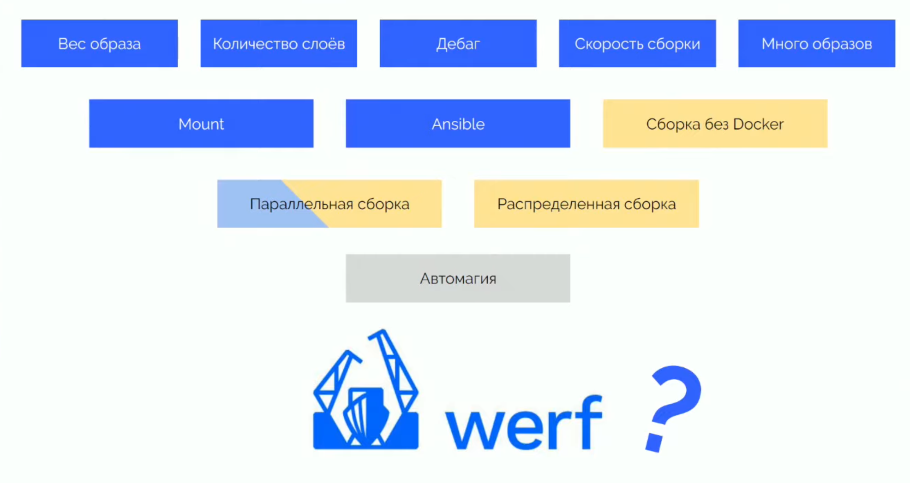
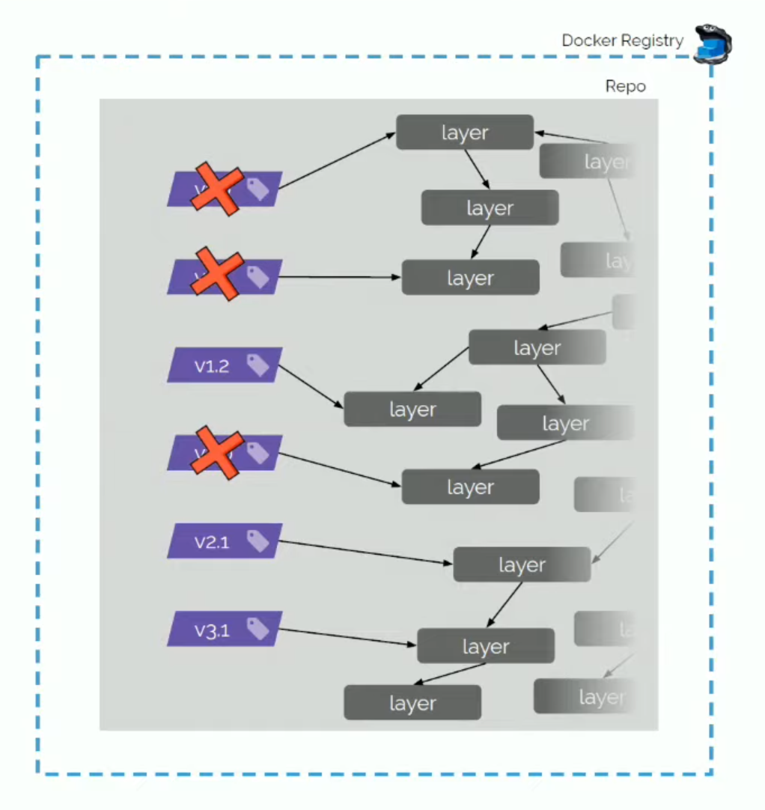
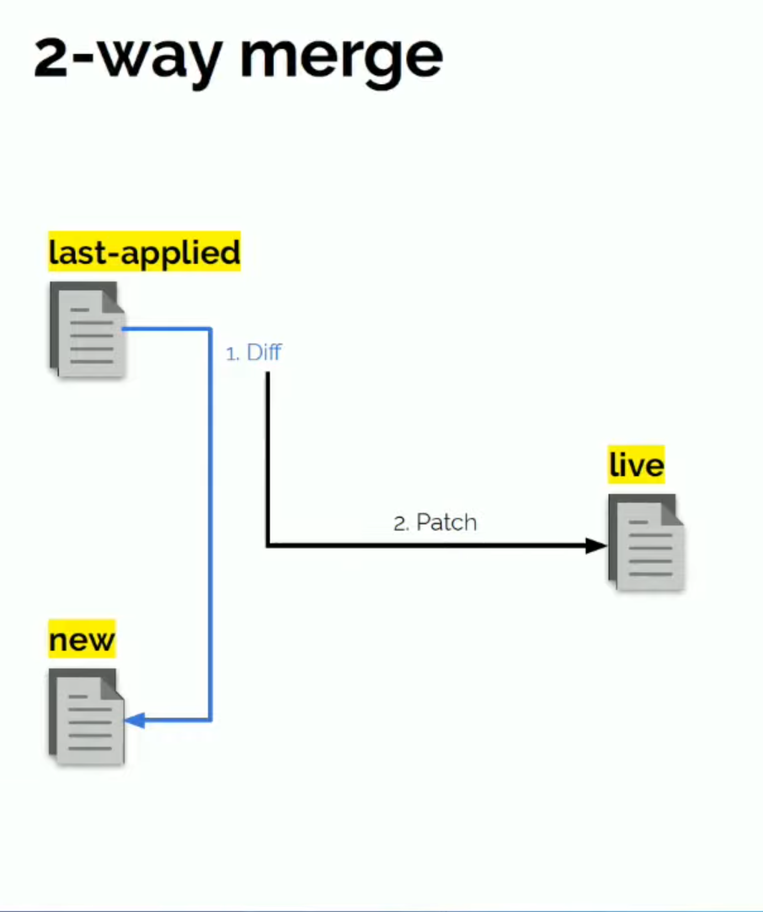
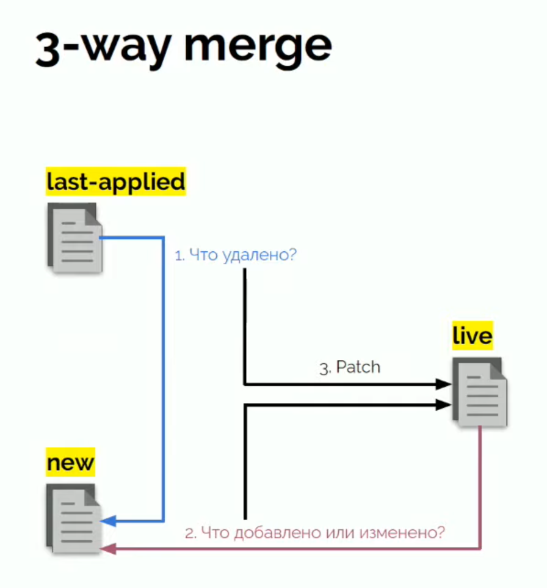
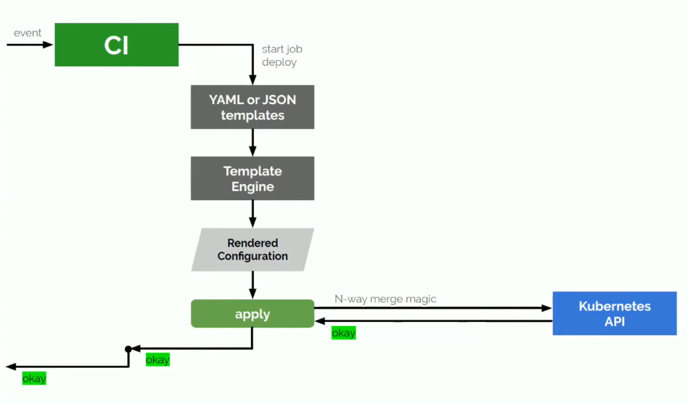
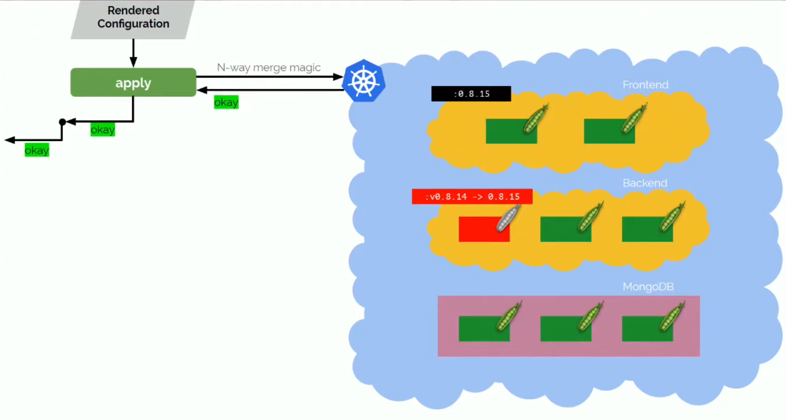

В первую очередь: сюда можно ставить звездочки [github.com/flant/werf](https://github.com/flant/werf)

# Доставка

Доклад про то, как делать доставку в K8s.
Есть софт, его нужно доставить на продакшен.

Есть цикл непрерывных улучшений.
Разработка, тестирование, доставка, метрики, снова разработка...

В нашем случае софт — это докер, а продакшен — это k8s.
Пока в проде не было k8s, продакшен для докера был вообще непонятным.
А когда появился k8s, продакшен стал стандартизованным и с API.
Когда-то то же самое произошло с софтом: было как попало, стало в докере.

Как выглядит доставка:

* Есть гит с кодом приложения и кодом сборки,
* мы собираем из этого докер-образ и пушим его в registry,
* ещё в гите есть инструкции как выполнять приложение, мы их отправляем в k8s на тест и на прод.
* И ещё там есть тесты, разные.
* Наконец, есть CI-система, которая всё это выполняет.

Immutable инфраструктура предполагает, что мы собираем образ, его тестируем и его же отправляем на прод.

Ещё важно, что инфраструктура — это код.
Как только мы это правило нарушаем, всё ломается.

Что такое delivery?
Это путь git -> build -> test -> release -> run.
Продукт доставлен только тогда, когда пользователь смог им воспользоваться.

У всей этой схемы на основе Git есть название: GitOps.
Давайте посмотрим на эту схему подробнее.

# Сборка (build)

Вес образа имеет значение.
Если идти прямым путём, то получится очень большой образ.
А если использовать multistage, то гораздо меньше.

Ещё все знают, что много слоёв — это плохо, а хорошо делать так:

Однако, попробуйте-ка подебажить такую сборку.
Где оно упало внутри этого шага? Никто не знает.
Приходится вручную выполнять по одной строке.

Ещё код приложения меняется часто, а зависимости редко.
Поэтому приходится сначала добавлять `requirements.txt`, потом `pip install -r requirements.txt`,
и только потом добавлять оставшийся код приложения.

Ещё нередко из одного репозитория мы можем собирать много образов.
Мы можем сделать много докерфайлов или один докерфайл со stage'ами,
и потом запускать сборку через shell-cкрипт.

И всё это только вершина айсберга!

* Есть ещё история с монтированием.
* Например, мы хотим закешировать результат работы какого-то менеджера зависимостей.
* Или мы хотим ssh и нам нужно пробросить сокет ssh-агента.
* Или мы хотим собирать образы без shell, а хотим использовать Ansible.
* Наконец, можно хотеть собирать образы вообще без Docker.
    Так нам для сборки понадобится виртуальная машина, но у нас же уже есть k8s.
    Однако, в нём докер, а в докере собирать докер-образы — это плохо.
* Параллельная сборка. Тут параллельность можно понять кучей способов.
* Распределенная сборка. Поды теряют кеши, с этим нужно что-то делать.
* Автомагия!

Чем решаются эти проблемы:

* moby/buildkit
* Kaniko
* Buildpacks.io
* buildah
* genuinetools/img

Параллельно развивается куча альтернативных сборщиков.
Каждый из них решает часть задачи, а целиком — ни один.

Werf делают пять лет.
Сделанное отмечено синим, план к концу этого лета — жёлтым.

# Публикация в registry (push)

Вопрос: как тегировать образ?

Нужно гарантировать воспроизводимость.
У нас есть коммит в гите, он иммутабельный.
Мы хотим из него собрать образ и сохранить связь между ними.
Когда на проде работает приложение, мы хотим узнавать, из какого коммита оно собрано.

## git tag 

Обычный путь такой:

1. Поставили тег в гите
2. Собрали образ и поставили тот же тег на него
3. Протестировали
4. Выкатили на прод

Тут есть проблемы:

* Порядок контринтуитивный. Мы сначала тегировали, а только потом тестируем.
* Плохо сочетается с git flow.

## git commit + tag

Собираем и тестируем образы из коммитов.
Когда очередной коммит/образ прошёл все тесты и мы готовы выкатывать его на прод, ставим тег на уже собранный образ.

Ограничение: только fast-forward merging, не поддерживает мерж-коммиты.

## Content addressable

Берём хеши исходных докер-образов, текст всех команд и хеши скопированных файлов.
Делаем из этого один хеш.
Он становится сигнатурой образа.
В список файлов можно не включать то, что не влияет на приложение, например changelog.

Плюс: сигнатура не меняется от мерж-коммитов.

Минус: нельзя точно восстановить, из какого коммита собран образ.
    Это решается слоем с метаданными.

# Очистка registry

Рано или поздно место в registry заканчивается.
Если мы пушим новый образ с тем же тегом, какие-то слои устаревают, и registry с этим справляется.
Но есть и тегированные образы, которые больше не нужны.
Давайте будем их удалять.

Стратегии очистки:

* Не чистить.
* Сделать полный сброс.
    А после удаления нажать везде build.
    Но тогда мы создадим много новых непротестированных образов.
* Blue-green. Непонятно, когда удалять старый.
* По времени. Тут мы либо слишком долго храним, либо удалим что-то нужное.
* Вручную.

Работоспособные варианты — не чистить вообще, либо сочетать blue-green с ручной очисткой.

Как эту задачу решает werf?

1. Git head: собираем все ветки.
    То, что протегировано в git, наверняка нужно в registry.
2. Что сейчас выкачено в k8s?
3. Что недавно было выкачено в k8s?
4. (в планах) анализируем Helm.

Из всего этого получаем whitelist.
Всё, что не в нём — удаляем из registry.
Потом удаляем из кешей всё, на что не ссылаются существующие образы.

# Деплой

## Изменение конфигураций

Конфигурация для k8s лежит в гите.
В момент деплоя конфиг становится сильно больше.
В него добавляются:
* идентификаторы,
* служебная информация,
* значения по умолчанию,
* статус,
* admission webhook'и,
* контроллеры всех видов и планировщик.

Получается, что в k8s находится некоторое живое проявление того, что было в гите.

Вот у нас новый коммит с новым конфигом.
Нельзя эту конфигурацию просто перезаписать.
Нужно сделать дифф между старой и новой и его накатить как патч на боевую версию.
Это называется «двухсторонний мерж» (2-way merge).
Так работает, например, Helm.

Можно делать иначе: между старой и новой версией смотреть, что удалено,
а между боевой и новой — что добавлено и изменено.

Вывод: декларативный подход не так прост.
Даже с декларативным описанием есть магия.
Но без декларативного подхода всё сильно хуже.

## Применено ≠ выкачено

Представим, что у нас есть CI-система.
Она получает ивент и запускает деплой:

1. Берёт шаблоны в YAML или JSON
1. Отдаёт их движку шаблонов
1. Получает отрендеренную конфигурацию
1. Применяет к ней изменения из боевой конфигурации k8s через 3-way merge.
1. Применяет результат обратно к k8s через API
1. K8s отвечает успехом CI-системе, а она отвечает пользователю.

Применена новая конфигурация? Да. Выкачена? Нет.

K8s отвечает OK, когда получил новую конфигурацию.
Но применяется она не моментально.
Так работают Helm и kubectl.

А если pod не сможет рестартануть с новой конфигурацией?
«Пуля вылетела, проблемы на вашей стороне».

Поэтому нужен трекер, который следит за состоянием k8s.
Если k8s ответил OK, CI будет ждать трекера, который вернёт ОК только когда конфигурация успешно задеплоилась.

Подходящий инструмент — библиотека [github.com/flant/kubedog](https://github.com/flant/kubedog).
Этот трекер встроен в werf.

Главная аннотация — `fail-mode`. Три варианта:

* IgnoreAndContinueDeployProcess. Забей и продолжай деплой.
* FailWholeDeployProcessImmediately. Падай сразу.
* HopeUntilEndOfDeployProcess. Жди и надейся.

Ещё важная аннотация: `failures-allowed-per-replica`.

Логи: `show-logs-until`.
Помогает собирать логи только до тех пор, когда pod готов.
Ошибки происходят до того, как он готов, и ошибки нам интересны.
А на готовый pod приходят задачи и в логах появляется куча шума, она нам неинтересна.

## Что мы вообще хотим от деплоя?

* Надёжную декларативность.
* Реальный статус.
* Логи.
* Прогресс. (Job висит — что происходит? Чего мы сейчас ждём?)
* Автоматический откат. Выкат должен быть атомарным: или оно выкатилось до конца, или откатилось назад.

# Заключение

Всё сложнее, чем кажется с первого взгляда.
Дьявол кроется в деталях.

Любой софт — сырое и глючное гавно, пока им не начнут пользоваться.

Давайте вместе добьём эту тему, и пойдём дальше, решать другие вопросы.
