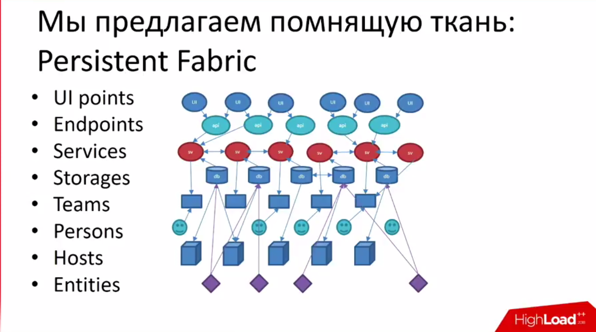

Николай руководит Data Platform в Avito. Сотни сервисов, сотни баз.

Как это бывает сначала: shared database.
У всех сервисов есть связь между собой и через базу.
Тестировать невозможно.
Поэтому при переходе на микросервисы у каждого сервиса своя база.
Если шардов несколько, то базы надо синхронизировать.

В реальности в компании есть сразу всё: и микросервисы с отдельными базами, и макро, и монолиты с shared database. 

Как начинается переписывание монолита на микросервисы? С доменного моделирования. Кто может его сделать? Никто, но есть люди, которые могут попробовать.

## Data discovery

Чтобы ориентироваться, нужен цифровой двойник инфраструктуры — Avito Platform Digital Twin. 

Задачи:

* В каких сервисах хранятся какие важные данные?
* Как важные данные путешествуют между сервисами?
* Кто может работать с какими данными? Как выдать и забрать права?
* Как поднять информационно-целостный подграф микросервисного графа? В частности, как прогреть ему кэши?

Решение — Persistent Fabric, «помнящая ткань».

База — это место, где сущности создаются и редактируются. Остальное — кеши.

К сущностям нужно как-то получать доступ, поэтому появляются команды, которым принадлежат сервисы. С сервисом без команды работать сложно. Конкретный человек, который много коммитил — не решение, потому что он может уволиться. Поэтому нужно хранить команды и людей за ними.

Не нужно заполнять весь граф вручную, данные можно достать во внутренних системах.

* Команды — 1С
* Сотрудники — LDAP
* Сервисы — Atlas
* Storages — Storage Discovery
* Entities
* Service Endpoints — из мониторинга. Если что-то не мониторится, значит оно не нужно.
* Метрики — тоже из мониторинга.

## Сценарий: выдача прав

Через граф проходим от хранилища к человеку, который подтверждает, что права можно давать.

Теперь нужно пройтись ещё раз и везде отметить вновь выданное право.

## Сценарий: точки использований сущности

Например, с персональными данными часто нужно стирать даже логи.

Связка: вызов сервиса сервисом

Запрос — проверка периметра. Откуда может утечь? Через сервисы или через шины.

## Сценарий: расследования сбоя на endpoint

## Сценарий: подграф изолированного тестирования

Поднять изолированный подграф и его тестировать или нагружать.

Проблема: у почти любого сервиса подграф входит и выходит в монолит. А монолит тянет всю систему.

## Поддержка системы

Как поддерживать и наполнять Persistent Fabric

* Каждый источник заполняет свою маленькую часть информации и связи между элементами.
* Эта инфа загружается в базу, с сохранением истории

Задачи in-progress

* Граф потоков данных через шины
* Граф связей UI points — граф пользовательских траекторий на основе клиентского логирования.
