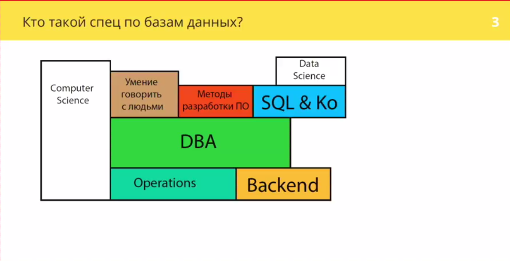

БД — вещь простая, а люди сложные, поэтому советы могут не всем подойти.

Сам следовал не всем советам.

# Кем мы хотим стать

Карта навыков:

Любой роли полезно иметь навыки из соседних областей. 

# Надо ли оно нам

* Скучно точно не будет. БД — это интересно.
* Покуда есть данные, будут и базы. Они могут поменяться, но они будут.
* DBA — как сантехник, но в тепле и за клавиатурой. Иногда не в тепле. :)

Как?

* Получить профильное образование?
    Забудьте, нет такого образования.
    Но есть ВУЗы, которые хорошо этому учат.
    Но выйдя из вуза, вы не станете спецом.
    Можно стать классным разработчиком ба данных или спецом по database computer science.
* Пройти курсы? 
* Прочитать книжку? 
* Методом проб и ошибок?

Идеальный экзамен на DBA в вакууме.

* На время починить базу, которую вы видите в первый раз, проблема непонятна, но всё тормозит.
* Экзаменаторов 10-20-30.
* 3 спрашивают «ну как» в слаке
* 3 спрашивают «ну как» по телефону
* 1 требует залогировать время
* 3 внедряют скрам прямо сейчас

# Теоретические знания

* Что первым приходит в голову?
    Реляционная алгебра.
    О ней стоит знать, но не изучать её больше недели, потому что она бесконечна.
    
    Пример: первая нормальная форма.
    Надо знать, но этого достаточно.
    Хорошая вводная книга: Новиков, Домбровская: Настройка приложений баз данных.

* Что вторым приходит в голову?
    B+, B* и т.п.
    Тоже не останется времени на дело.
    
    
Суть: СУБД — это фреймворк для работы с данными.
Он универсальный, надёжный, производительный.
Как это происходит — нужно знать досконально.

# Практические технические навыки

Конкретно что нужно знать:

* Concurrency control

    * 2 phase locking
    * deadlock detection
    * multi version concurrency control
    
* Recovery

    * write ahead log
    * redo
    * undo
    
* Distributed transactions

    * 2 phase commit
    * distributed recovery

Что читать?

* минимум — википедия
* лучше книжка: G. Weikum, G. Vossen, Tranactional Informatino Systems: Theory, Algorithms, and the Practice of Concurrencty Control and Recovery.

Как читать?

* в первый раз не читать про объекты и поисковые структуры
* потом читать ещё и ещё

Подводные камни:

* не путать двухфазное блокирование и двухфазный коммит
* не противоставлять двухфазное блокирование и MVCC

Всё это — пессимистические алгоритмы, они самые распространённые, но мир ими не ограничен.

Отвыкайте читать книги и привыкайте читать документацию:

* Хороших книг по практике мало.
* Они редко и недолго бывают актуальными.

Как читать документацию?

* Если один раз прочитать документацию о каждом параметре `postgresql.conf`, вы станете намного круче.
* Это же касается любой другой базы.
* Заведите тестовый сервер и экспериментируйте, как влияют разные параметры.

Решаем проблемы

* сохраняйте спокойствие
* ищем причину: do not tune the query / know your data — думайте как устроен запрос, а не пытайтесь решить силком
* учите **заранее** средства диагностики — top, iostat, perf и другие

# Практические нетехниеские навыки

* Учитесь говорить, писать и читать по-русски и по-английски.
* Делайте доклады — учите коллег, выступайте на митапах, подавайтесь на Highload!
* Учитесь общаться с девелоперами, бизнесом и не только с ними. Без девелоперов и бизнеса не будет БД.

Всё это придётся делать одновременно.
